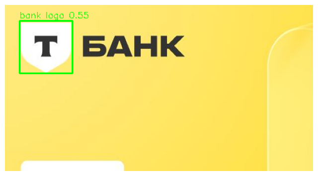

# Отборочный экзамен для трека CV "Детекция логотипа Т-Банка"

### Цель

Разработать REST API сервис для автоматического поиска и детекции логотипа Т-Банка на изображениях.

<p align="center">
  
  <br/>
  <em>Логотип Т-Банка</em>
</p>

### Задачи

1. Провести разметку датасета для обучения модели.

2. Обучить модель для детекции логотипа Т-Банка на полученном датасете.

3. Подготовить валидационный набор данных и посчитать метрики качества.

4. Реализовать REST API сервис.

5. Упаковать решение в Docker контейнер.

6. Подготовить документацию.

### Требования

* Время обработки: не более `10` секунд на изображение.
* Железо: Поддержка запуска на видеокарте с 16GB видеопамяти (уровня google collab T4).
* Поддерживаемые форматы входных изображений: `JPEG, JPG, PNG, BMP, WEBP`.
* Порт сервиса: `8000`.
* Доступен эндпоинт `/detect` для загрузки изображения и получения координат найденных логотипов.
* API строго соответствует контракту, описанному через Pydantic-схемы (смотри файл `app/schemas.py`)


## ✍️ Руководство по запуску

1. Клонирование репозитория.

Склонируйте проект с GitHub и перейдите в директорию:

```bash
git clone https://github.com/og1grib/tbank-logo-detector.git

cd tbank-logo-detector
```

2. Подготовка весов модели.

Скачайте обученные веса для YOLO модели (файл `best.pt`) [по ссылке](https://disk.yandex.ru/d/cdiki5BBrG2OvQ). 

Поместите файл в директорию:

```bash
weights/best.pt
```

3. Сборка Docker-образа.

```bash
docker build -t tbank-logo-detector .
```

4. Запуск контейнера.

```bash
docker run --rm -p 8000:8000 tbank-logo-detector
```

5. Проверка работы API.

После запуска контейнера API сервис будет доступен по адресу: [http://localhost:8000](http://localhost:8000). 

При переходе по ссылке вы должны увидеть:  
```json
{"status":"ok", "docs":"/docs", "message":"T-Bank logo detection API is running"}
```

Для тестирования можно использовать встроенный Swagger UI: [http://localhost:8000/docs](http://localhost:8000/docs). 

В Swagger необходимо открыть эндпоинт `/detect`, нажать `Try it out`, загрузить изображение и выполнить запрос.

Возможные результаты:

* Успешная детекция (код 200). В ответе будут координаты найденного логотипа в формате:

```
{
  "detections": [
    {
      "bbox": {
        "x_min": 100,
        "y_min": 100,
        "x_max": 200,
        "y_max": 200
      }
    }
  ]
}
```

* Ошибка (код 400). Например, если загрузить неподдерживаемый формат файла:

```
{
  "error": "UnsupportedFileExtension",
  "detail": "Недопустимое расширение файла: .svg. Разрешены: .jpg, .jpeg, .png, .bmp, .webp"
}
```

6. Ура! 🎉 Теперь вы можете пользоваться сервисом для автоматического поиска и детекции логотипа Т-Банка на изображениях.  


## Описание решения

### Работа с датасетом

Для формирования обучающей и валидационной выборки был использован предоставленный неразмеченны датасет, содержащий изображения с логотипами Т-Банка в различных условиях и изображения без логотипа.

1. Первоначально была предпринята попытка разметки с помощью **zero-shot** подхода (**GroundingDINO**) с различными промптами. В итоге промпт `"bank logo with stylized T letter inside a shield emblem"` и `box_thr=0.4` показал неплохие результаты для изображений с логотипом Т-Банка (`notebook/preprocess_data.ipynb`).


<p align="center">
  
  <br/>
  <em>Пример успешной разметки с помощью GroundingDINO</em>
</p>


2. Однако все же разметка была неидеальная и далее была выполнена доразметка вручную с помощью сервиса [Roboflow](https://roboflow.com/).

Итоговый датасет полученный с помощью Roboflow можно найти [здесь](https://app.roboflow.com/grigorii-byskz/my-first-project-hkgjz/2). 

В датасет включены изображения с логотипами (**positive**), так и изображения без логотипов (**negative**). Данные разделены на обучающую и валидационную выборку в пропорции **80/20**. Всего 1797 изображений - 1444 обучающей и 353 валидационной. 

### Обучение модели

Была выбрана архитектура **YOLOv8m**.

Скрипт обучения доступен по [ссылке](https://www.kaggle.com/code/grishagerasimov01/tbank-yolo-logo-detection) на Kaggle Notebook

Результатом обучения является файл весов `best.pt`, который используется сервисом для инференса.

Валидационный датасет (): https://disk.yandex.ru/d/kvFk4RoyNSFlLQ


<!-- 


### Ожидаемый формат решения

Дополнительно в `README.md` необходимо описать подход к решению задачи с достаточной степенью подробности.

Так же вам необходимо реализовать скрипт валидации качества решения и подсчета метрик на отобранных и размеченных примерах. Для оценки воспроизводимости результата валидационную выборку необходимо по аналогии с моделью выложить в открытый доступ (github и/или открытый файлообменник).

### Критерии оценивания

2. **Техническое качество (25%)**
   * Качество кода и архитектуры
   * Обработка ошибок
   * Производительность (время обработки)
   * Использование best practices
3. **Документация (40%)**
   * Качество README.md
   * Подробное описание подхода к решению
   * Описание процесса работы с данными в процессе подготовки к решению.
   * Инструкции по запуску и использованию
   * Результаты работы модели на вашей валидационной выборке (с отрисоваными результатами детекции)
4. **Дополнительные (в свободном формате) (10%)**
   * Предложения альтернативных подходов к решению
   * Проведенный анализ проблем решения и рассуждения по возможности их решения
   * Проведенный анализ производительности решения и предложение вариантов по его ускорению

### Подсказки

* Документируйте свои эксперименты и выбор подхода в процессе работы.
* Обращайте внимание на качество оформления `README.md`, пишите свои шаги по решению максимально подробно, документация будет проверяться в первую очередь.

Удачи!